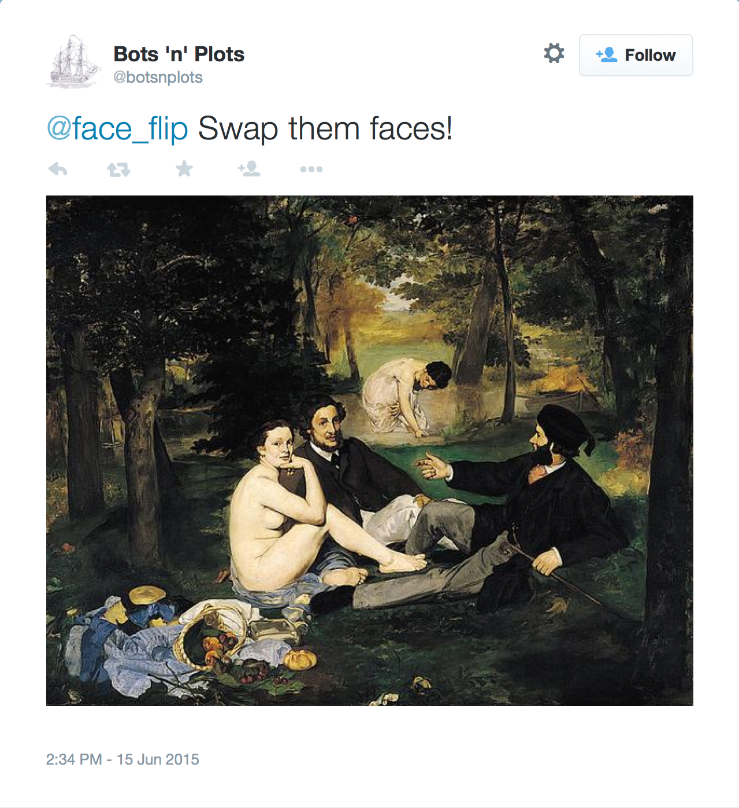
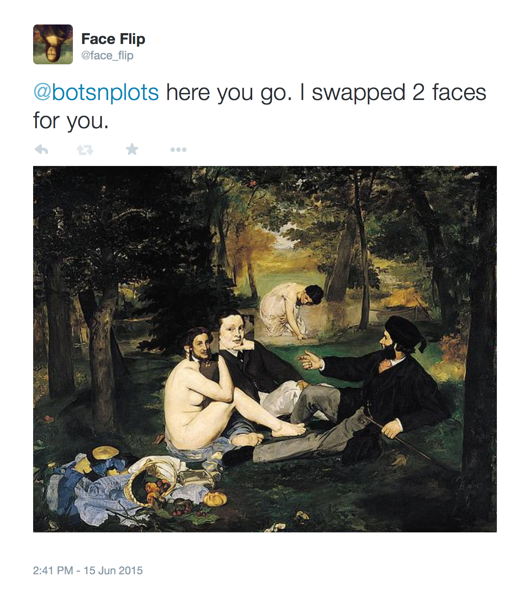

# Face Bot Example

A twitter bot that will swap, flip, or mark faces in an image tweeted at it.  
See [@face_flip](https://twitter.com/face_flip).
	

# Setup

Here's a quick setup procedure for OSX...

## Preparation

You should have `OpenCV` and `Numpy`:

	brew install numpy
	brew install opencv

I recommend using `virtualenv` and `virtualenvwrapper`:
	
	pip install virtualenv
	pip install virtualenvwrapper
	
Make sure your virtualenvwrapper is activated!  
The line below should probably reside inside your `.profile` or `.bash_profile` file:

	source /usr/local/bin/virtualenvwrapper.sh
	

## Installation

Setup a virtualenv

	mkvirtulenv faceflip
	
Install the required python packages inside the virtualenv:

	pip install -r requirements.txt	
	
Make sure we have access to OpenCV from inside the virtualenv:

	add2virtualenv /usr/local/lib/python2.7/site-packages

Create a file named `keys.py` that looks like this:

	consumer_key="YOUR CONSUMER KEY"
	consumer_secret="YOUR CONSUMER SECRET"
	access_token = "YOUR ACCESS TOKEN"
	access_token_secret = "YOUR ACCESS TOKEN SECRET"

Create an app on twitter [here](https://apps.twitter.com/) and copy the respective keys into your `keys.py`

## Running the Bot

Just run `facebot.py`

	 python facebot.py
	 
